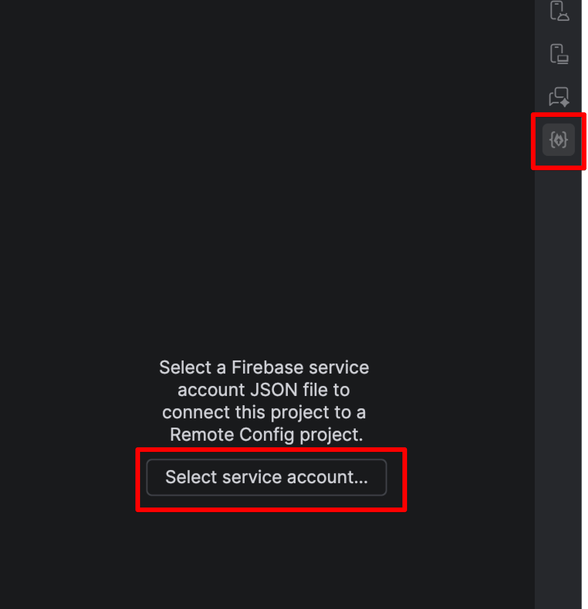
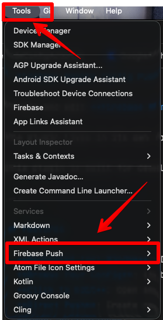
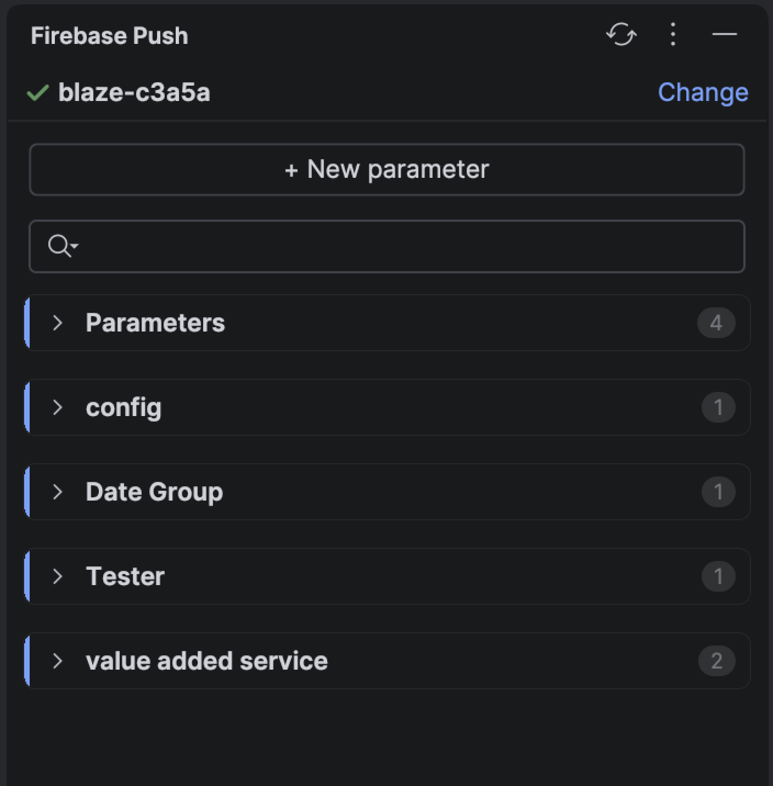
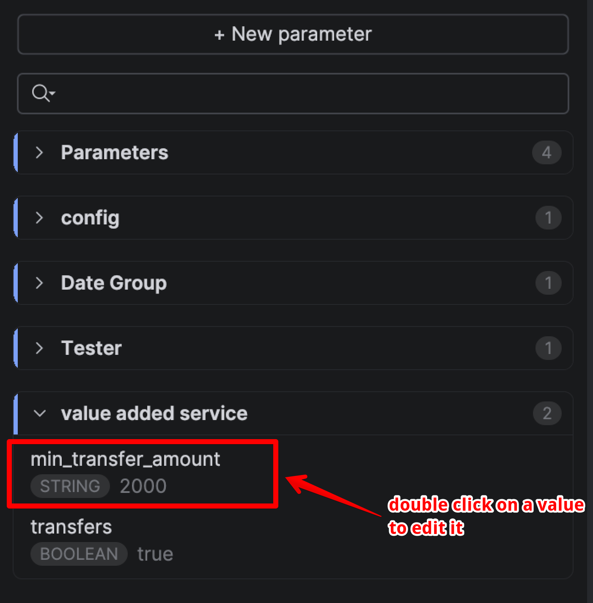
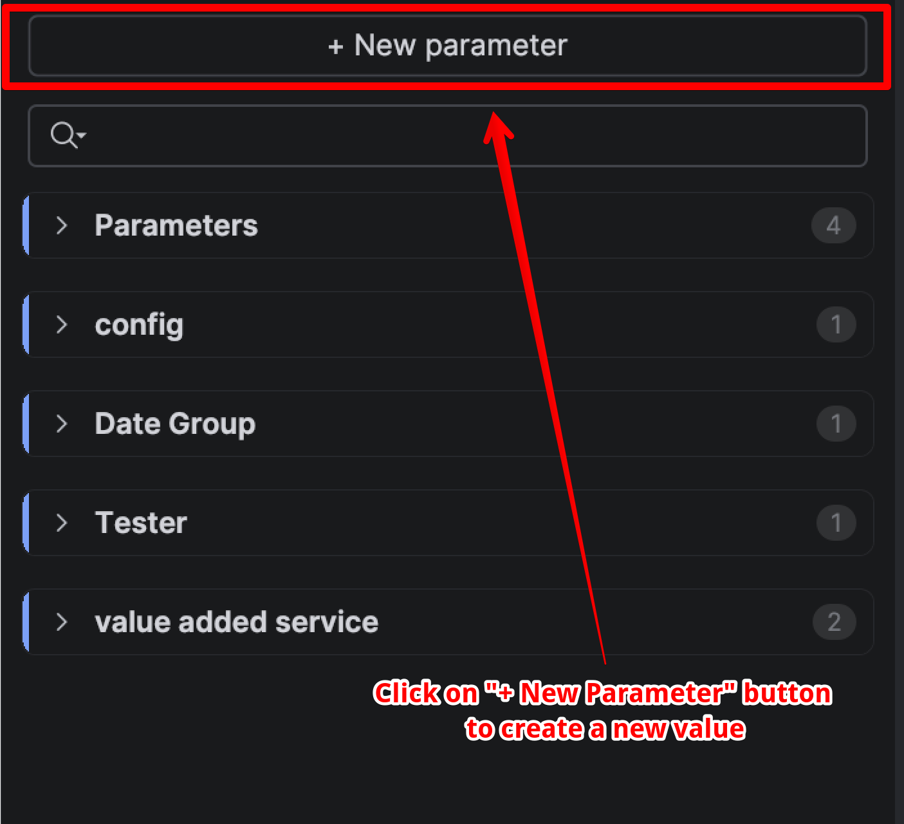

# Firebase Remote Config Push (Android Studio / IntelliJ)

Browse and edit **Firebase Remote Config** directly from **Android Studio** or **IntelliJ IDEA**—no Firebase Console needed.

The plugin lives in its own tool window, docked on the right like Gradle or Device Manager: open it once and your project's parameters are right there, ready to edit.

This plugin is built for developers who want a **fast, safe, and simple** way to manage Remote Config while staying inside their IDE.

---

## Features

- **Dedicated Tool Window**: Its own icon on the right-hand tool window bar—no menu diving to get back to it.
- **Browse Your Config**: Lists every existing parameter and parameter group, with type and current value at a glance. Filter by key to find things fast.
- **Double-Click to Edit**: Open any parameter pre-filled, change the value, and save.
- **Direct Push**: Create new parameters, in the root or in any group.
- **Smart Validation**:
  - **Key Check**: Prevents invalid key formats (only letters, numbers and underscores).
  - **Type Support**: Validates **JSON**, **Number**, **Boolean**, and **String** before pushing.
- **Conditional Values Preserved**: Editing a parameter that has conditional values keeps them, along with its description.
- **Project Awareness**: Displays the active Firebase Project ID at the top of the panel to prevent accidental pushes to the wrong environment.
- **Safe Merging**: Automatically fetches the current template and merges your changes—**never** overwrites your entire configuration.
- **Project Isolation**: Service account path is saved per project, so each project uses its own credentials.

---

## Supported Value Types

- **String**
- **Number**
- **Boolean**
- **JSON**

---

## Requirements

Before using this plugin, make sure you have:

- A **Firebase project**
- A **Firebase Service Account JSON file**
- The service account must have **Remote Config Admin** permissions

---

## Step-by-Step Setup & Configuration

### Step 1: Create a Firebase Service Account

1. Go to **Firebase Console**
2. Open your project
3. Navigate to:
   ```
   Project Settings → Service Accounts
   ```
4. Click **Generate new private key**
5. Download the `.json` file

> **Important:**
> Never commit this file to Git. Add it to your `.gitignore`.

---

### Step 2: Connect Your Project

1. Open **Android Studio**
2. Click the **Firebase Push** icon on the right-hand tool window bar
3. Click **Select service account…** and choose the `.json` file you downloaded

The path is saved **per project**, so you only do this once.




Everything is also reachable from the menu bar, under **Tools → Firebase Push**:



*The same actions live under Settings → Tools → Firebase Push.*

---

### Step 3: Edit an Existing Value

1. The panel lists your parameters, grouped exactly as they are in Firebase
2. Double-click any parameter—or select it and press <kbd>Enter</kbd>—to open it
3. Change the **Value** (and **Type** if needed) and click **Save to Firebase**



*Every group with its parameter count, and every parameter with its type and current value. Use the filter box to narrow a long list.*



*Opening a parameter fills the form from what Firebase currently holds. **‹ Back** returns to the list.*

> Keys and groups cannot be changed from here—renaming would create a duplicate rather than moving
> the original. Create a new parameter instead.

---

### Step 4: Create a New Value

1. Click **+ New parameter** at the top of the panel



2. Fill in the form:
   - **Key** → e.g. `enable_new_checkout`
   - **Type** → String / Number / Boolean / JSON
   - **Value** → `true`
   - **Parameter group** → leave blank for root parameters
3. Click **Push to Firebase**

The plugin will:

- Fetch the existing Remote Config template
- Merge your change safely
- Push only the updated values

---

## Switching Firebase Projects

Click **Change** next to the project name at the top of the panel, and pick a different service account file.

Or go to **Tools → Firebase Push → Reset Service Account** to disconnect entirely.

---

## Menu Actions

All actions live under **Tools → Firebase Push**:

| Action | What it does |
| --- | --- |
| **Push to Remote Config** | Opens and focuses the tool window |
| **Select Service Account** | Picks the service account JSON file |
| **Reset Service Account** | Disconnects the current service account |

The tool window's own toolbar has a **Reload Remote Config** button to re-fetch the template.

---

## Best Practices

- Always add service account files to `.gitignore`
- Use separate service accounts for staging and production
- Never share service account keys publicly
- Double-check the **Project ID** shown at the top of the panel before pushing

> **There is no dry-run.** Every push writes to the live Remote Config template of the connected
> project and takes effect for real clients immediately. Point the plugin at a staging project while
> you are getting familiar with it.

---

## Who This Is For

- Android developers
- Flutter engineers
- Mobile developers
- Anyone tired of opening Firebase Console just to update a flag

---

**Built with ❤️ for Flutter & Mobile Developers**
